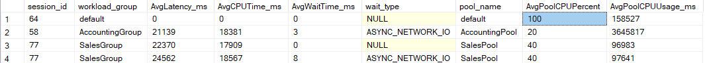
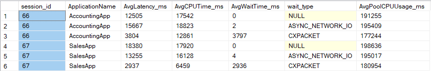
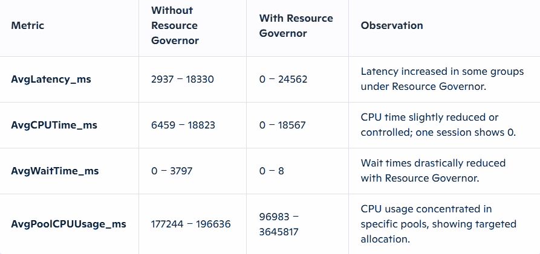

# Resource-Governor-Impact-Analysis
**Description: Compares SQL Server behavior with and without Resource Governor, showing how resource control improves stability and prioritizes important queries.**
All SQL scripts used in this project are available here:[scripts](FullRepro.sql)
**1. create a table with a large dataset of 1 million rows.**
```sql
DROP TABLE IF EXISTS BigTable;
GO

CREATE TABLE BigTable (
    ID INT IDENTITY(1,1) PRIMARY KEY,
    Value CHAR(200)
);
GO

SET NOCOUNT ON;

INSERT INTO BigTable (Value)
SELECT TOP (1000000)
       REPLICATE('Y', 200)
FROM master.sys.all_objects a
CROSS JOIN master.sys.all_objects b
CROSS JOIN master.sys.all_objects c;
GO

SELECT COUNT(*) AS TotalRows
FROM BigTable;
GO  --1,000,000
```
**3.configure Resource Governor from scratch and remove the previous settings.**
```SQL
USE MASTER;
GO

-- Disable RG if already enabled
ALTER RESOURCE GOVERNOR DISABLE;
GO

-- Reset classifier
ALTER RESOURCE GOVERNOR
WITH (CLASSIFIER_FUNCTION = NULL);
GO
ALTER RESOURCE GOVERNOR RECONFIGURE;
GO
```
**4.create logins and application names,For each group.**
```SQL
USE Master;
GO
-- Management
CREATE LOGIN ManagementLogin
WITH PASSWORD = '123456';
GO

USE PRACTIE;
GO
CREATE USER ManagementUser
FOR LOGIN ManagementLogin;
GO
ALTER ROLE db_owner ADD MEMBER ManagementUser;
GO


USE Master;
GO
-- Sales
CREATE LOGIN SalesLogin
WITH PASSWORD = '123456';
GO

USE PRACTIE;
GO
CREATE USER SalesUser
FOR LOGIN SalesLogin;
GO
ALTER ROLE db_datareader ADD MEMBER SalesUser;
GO 
ALTER ROLE db_datawriter ADD MEMBER SalesUser;
GO


USE Master;
GO
-- Default
CREATE LOGIN DefaultLogin
WITH PASSWORD = '123456';
GO

USE PRACTIE;
GO
CREATE USER DefaultUser
FOR LOGIN DefaultLogin;
GO
ALTER ROLE db_datareader ADD MEMBER DefaultUser;
GO 
ALTER ROLE db_datawriter ADD MEMBER DefaultUser;
GO
```

**Note**:"There is no need to create a login for Default. If it is not created, the login will be treated as Default by default."

**5.enable Resource Governor.**
**5-1.create the resource pools for every login with an application name.**
```SQL
DROP RESOURCE POOL AccountingPool;
GO
-- Accounting Pool - 20%
CREATE RESOURCE POOL AccountingPool
WITH (
    MAX_CPU_PERCENT = 20
);
GO

DROP RESOURCE POOL ManagementPool;
GO
-- Management Pool - 30%
CREATE RESOURCE POOL ManagementPool
WITH (
    MAX_CPU_PERCENT = 30
);
GO

DROP RESOURCE POOL SalesPool;
GO
-- Sales Pool - 40%
CREATE RESOURCE POOL SalesPool
WITH (
    MAX_CPU_PERCENT = 40
);
GO

--Default Pool=10%
```
**5-2.Enable Resource Governor and Create Classifier Function:**
```SQL
USE MASTER;
GO

CREATE FUNCTION dbo.ResourceGovernorClassifier1()
RETURNS sysname
WITH SCHEMABINDING
AS
BEGIN
    DECLARE @GroupName sysname;

    IF APP_NAME() = 'AccountingApp' 
	SET @GroupName = 'AccountingGroup';

	ELSE IF APP_NAME() = 'ManagementApp'
	SET @GroupName = 'ManagementGroup';

	ELSE IF APP_NAME() = 'SalesApp'
	SET @GroupName = 'SalesGroup'; 

	ELSE SET @GroupName = 'default';

    RETURN @GroupName;
END;
GO

ALTER RESOURCE GOVERNOR 
WITH (CLASSIFIER_FUNCTION = dbo.Classifier5);

ALTER RESOURCE GOVERNOR RECONFIGURE;
GO
```

**6.Creating a table to capture query execution statistics, including CPU consumption, total elapsed time, CPU time, and related performance metrics:**
```SQL

DROP TABLE IF EXISTS ResourceGovernorMonitoringLog;
GO

CREATE TABLE ResourceGovernorMonitoringLog (
    LogTime            DATETIME2(3),
    session_id         INT,
    workload_group     SYSNAME,
    total_elapsed_time BIGINT,
    cpu_time           BIGINT,
    wait_time          BIGINT,
    wait_type          NVARCHAR(60),
    pool_name          SYSNAME,
    pool_cpu_percent   INT,
    pool_cpu_usage_ms  BIGINT
);
GO
```

**7.We clear the buffer pool to ensure data accuracy.**
```SQL
DBCC DROPCLEANBUFFERS;
GO
```

**8.execute heavy queries in the Accounting and Sales groups,
and two light queries in the Management and Default groups, while simultaneously recording metrics such as CPU time, latency, CPU usage, etc., into a table.**
```SQL
--Accounting
SELECT 
    SUSER_NAME() AS CurrentLogin,
    APP_NAME() AS CurrentAppName;
GO

WITH CTE AS (
    SELECT TOP 3000000 a.*
    FROM BigTable a
    CROSS JOIN BigTable b
    WHERE a.ID < 1000
)
SELECT *
FROM CTE
ORDER BY NEWID();
GO

--Sales
SELECT APP_NAME() AS CurrentAppName, SUSER_NAME() AS CurrentLogin;
GO

DBCC DROPCLEANBUFFERS;
GO

WITH CTE AS (
    SELECT TOP 3000000 a.*
    FROM BigTable a
    CROSS JOIN BigTable b
	    CROSS JOIN BigTable C
    WHERE a.ID < 10000
)
SELECT *
FROM CTE
ORDER BY NEWID();
GO

--Management
SELECT APP_NAME() AS CurrentAppName, SUSER_NAME() AS CurrentLogin;
GO
SELECT * FROM BigTable WHERE ID = 1;
GO 200


```

**9.Executing the light query with the Default login while simultaneously capturing CPU time, CPU usage, latency, and other metrics into The table.**
```SQL

--Default
SELECT TOP 1 *
FROM BigTable
WHERE ID = 1000;
GO


INSERT INTO ResourceGovernorMonitoringLog
(
    LogTime,
    session_id,
    workload_group,
    total_elapsed_time,
    cpu_time,
    wait_time,
    wait_type,
    pool_name,
    pool_cpu_percent,
    pool_cpu_usage_ms
)
SELECT
    SYSDATETIME(),
    r.session_id,
    g.name,
    r.total_elapsed_time,
    r.cpu_time,
    r.wait_time,
    r.wait_type,
    p.name,
    p.max_cpu_percent,
    p.total_cpu_usage_ms
FROM sys.dm_exec_requests r
JOIN sys.dm_exec_sessions s ON r.session_id = s.session_id
JOIN sys.dm_resource_governor_workload_groups g ON s.group_id = g.group_id
JOIN sys.dm_resource_governor_resource_pools p ON g.pool_id = p.pool_id
WHERE r.session_id > 50;
GO
```

**10.Using the query below, we extract the desired information.**
```SQL
SELECT 
    log.session_id,
    log.workload_group,
    s.program_name AS ApplicationName,
    AVG(log.total_elapsed_time) AS AvgLatency_ms,
    AVG(log.cpu_time) AS AvgCPUTime_ms,
    AVG(log.wait_time) AS AvgWaitTime_ms,
    log.wait_type,
    log.pool_name,
    AVG(log.pool_cpu_percent) AS AvgPoolCPUPercent,
    AVG(log.pool_cpu_usage_ms) AS AvgPoolCPUUsage_ms
FROM ResourceGovernorMonitoringLog log
JOIN sys.dm_exec_sessions s
    ON log.session_id = s.session_id
GROUP BY 
    log.session_id, 
    log.workload_group, 
    s.program_name,
    log.wait_type, 
    log.pool_name
ORDER BY log.workload_group, log.session_id;
GO
```


[REAL RESULT](ResultwithResGov.CSV)

 **10.completely disable Resource Governor.**

```SQL
USE MASTER;
GO

-- Disable RG if already enabled
ALTER RESOURCE GOVERNOR DISABLE;
GO

-- Reset classifier
ALTER RESOURCE GOVERNOR
WITH (CLASSIFIER_FUNCTION = NULL);
GO
ALTER RESOURCE GOVERNOR RECONFIGURE;
GO
```

**11.clear the buffer pool and the table that stored the information, then run the same queries with the same logins and store the results in the table.**
```SQL
DBCC DROPCLEANBUFFERS;
GO
DELETE 
FROM ResourceGovernorMonitoringLog;
GO

--Accounting
WITH CTE AS (
    SELECT TOP 3000000 a.*
    FROM BigTable a
    CROSS JOIN BigTable b
    WHERE a.ID < 1000
)
SELECT *
FROM CTE
ORDER BY NEWID();
GO

--Sales
WITH CTE AS (
    SELECT TOP 3000000 a.*
    FROM BigTable a
    CROSS JOIN BigTable b
	    CROSS JOIN BigTable C
    WHERE a.ID < 10000
)
SELECT *
FROM CTE
ORDER BY NEWID();
GO

--Management
SELECT * FROM BigTable WHERE ID = 1;
GO 200

SELECT TOP 1 *
FROM BigTable
WHERE ID = 1000;
GO 25

INSERT INTO ResourceGovernorMonitoringLog
(
    LogTime,
    session_id,
    workload_group,
    total_elapsed_time,
    cpu_time,
    wait_time,
    wait_type,
    pool_name,
    pool_cpu_percent,
    pool_cpu_usage_ms
)
SELECT
    SYSDATETIME(),
    r.session_id,
    g.name,
    r.total_elapsed_time,
    r.cpu_time,
    r.wait_time,
    r.wait_type,
    p.name,
    p.max_cpu_percent,
    p.total_cpu_usage_ms
FROM sys.dm_exec_requests r
JOIN sys.dm_exec_sessions s ON r.session_id = s.session_id
JOIN sys.dm_resource_governor_workload_groups g ON s.group_id = g.group_id
JOIN sys.dm_resource_governor_resource_pools p ON g.pool_id = p.pool_id
WHERE r.session_id > 50;
GO

```

**12.Using the query below, we extract the desired information.**
```SQL

SELECT 
    log.session_id,
    log.workload_group,
    s.program_name AS ApplicationName,
    AVG(log.total_elapsed_time) AS AvgLatency_ms,
    AVG(log.cpu_time) AS AvgCPUTime_ms,
    AVG(log.wait_time) AS AvgWaitTime_ms,
    log.wait_type,
    log.pool_name,
    AVG(log.pool_cpu_percent) AS AvgPoolCPUPercent,
    AVG(log.pool_cpu_usage_ms) AS AvgPoolCPUUsage_ms
FROM ResourceGovernorMonitoringLog log
JOIN sys.dm_exec_sessions s
    ON log.session_id = s.session_id
GROUP BY 
    log.session_id, 
    log.workload_group, 
    s.program_name,
    log.wait_type, 
    log.pool_name
ORDER BY log.workload_group, log.session_id;
GO
```


[REAL RESULT](ResultwithoutRG.png.CSV)

**Now comparing the results of both cases together.**
**Performance Comparison**




**Final Conclusion**
**Wait times:** Improved significantly ✅

**CPU control:** Effective ✅

**Resource allocation:** Targeted and group-specific ✅

**Latency:** Increased for some workloads ⚠️

**Overall:** Resource Governor proved useful in controlling CPU usage and reducing wait times, even though latency increased for certain groups. This trade-off is acceptable when prioritizing fair resource distribution across workloads.

**summary:**
Resource Governor limits CPU for low-priority queries, increasing their latency and execution time, while ensuring high-priority workloads run efficiently. Overall, it improves system stability and reduces resource contention.


